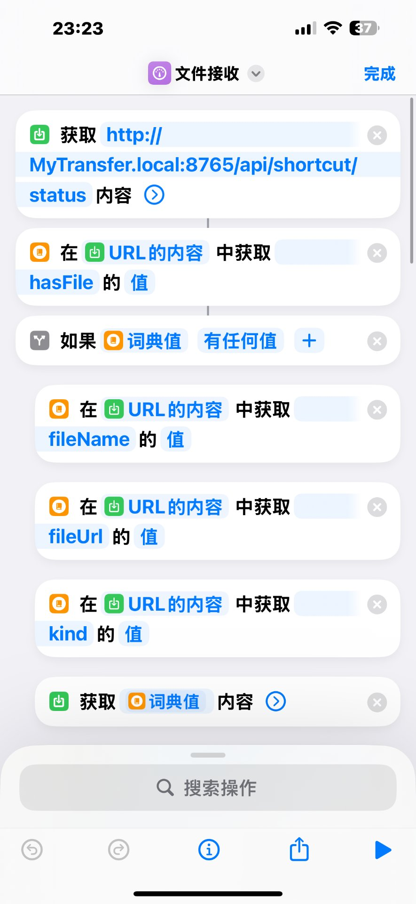
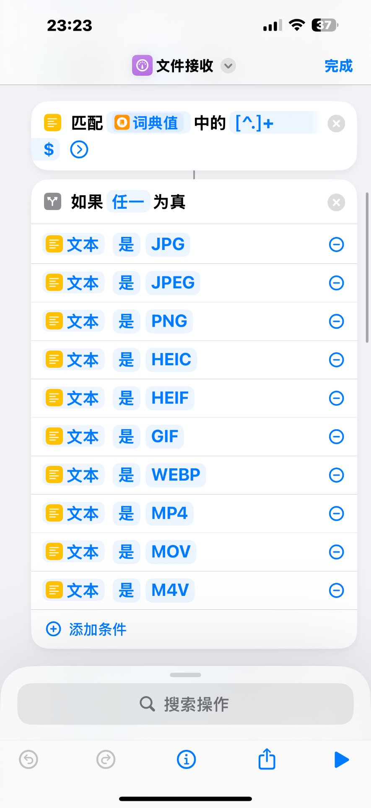
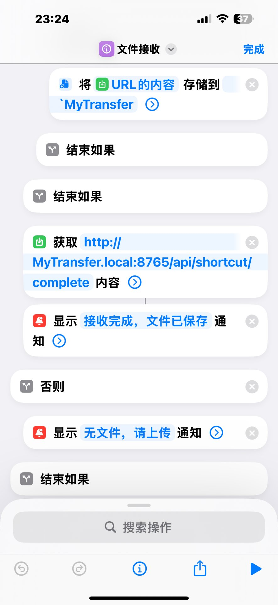

# MyTransfer（握手）

局域网文件传输工具：**Windows 电脑为主控端，iPhone 用一个快捷指令接收**。
不打开网页、不输 IP、不填端口，点一下快捷指令就完成「连接 → 下载 → 保存 → 校验」。

## 功能

- **自动发现**：电脑通过 mDNS/Bonjour 广播 `MyTransfer._http._tcp.local`（含主机名 A 记录），iPhone 直接用 `MyTransfer.local` 域名连接，换网络不用改任何配置。
- **多文件队列**：电脑一次排多个文件；支持「待发送」文件夹自动监控 + 勾选发送。
- **流式传输**：4MB 分块发送，内存占用不随文件大小增长（500MB 实测峰值 ~64MB）。
- **自动分流保存**：电脑按扩展名给文件标 `kind`（photo/video/file），
  iPhone 快捷指令按 kind 分流——照片/视频进**相册**，其它进**文件 App 的 MyTransfer**。
- **完整性校验不造假**：源文件 SHA256 + 实际发出流 SHA256 + 字节数三方比对；
  断线、谎报完成一律判失败。
- **每一步可见**：快捷指令的每次请求在电脑日志里都有人话标签（查询状态/下载文件/回报完成）。

## 下载

| 平台 | 方式 |
|---|---|
| Windows | [Releases → MyTransfer-Windows-x64.exe](https://github.com/zh152-del/MyTransfer/releases/latest)（单文件免安装，双击即用） |
| iPhone | 不用下载 App，按下文创建一个快捷指令 |

## 电脑端使用

1. 双击 exe（或 `python MyTransfer.py`，需 Python 3.10+ 与 tkinter）。首次运行自动加防火墙规则。
2. 点「＋ 选择文件发送」，或把文件丢进程序目录的「待发送」文件夹再勾选发送。
3. 等待接收方来取，完成后窗口显示 `[OK] 字节数 xx/xx 一致`。

---

# iPhone 快捷指令创建教程（照抄即可，约 10 分钟）

> 细到每一次点击。四张截图就是搭完的真实样子，与步骤一一对应。

## 准备：开始前确认 3 件事

1. 电脑端 MyTransfer 正在运行（右上角显示"服务运行中"）。
2. iPhone 和电脑连**同一个 Wi-Fi**。
3. Safari 打开 `http://MyTransfer.local:8765/api/shortcut/status`，能看到一串 `{ "hasFile" ... }` 文字 = 网络通。

**添加动作的通用方法**：打开「快捷指令」App → 右上角 **＋** 新建、改名为 `文件接收`
→ 点底部 **🔍 搜索动作** 输入框 → 打动作名 → 点结果添加。
**每个框里填什么，下面全部写死，照抄即可。**

## 第 1~7 步：查状态 → 取字段 → 下载

依次添加 7 个动作：

| # | 动作（搜索框输入加粗词） | 怎么填 |
|---|---|---|
| 1 | **获取 URL 内容** | 网址**用键盘打字**：`http://MyTransfer.local:8765/api/shortcut/status` |
| 2 | **获取词典值** | 输入选「URL 的内容」，键填 `hasFile` |
| 3 | **如果** | 输入选「词典值」，条件类型保持「**有任何值**」 |
| 4 | **获取词典值** | 输入选「URL 的内容」，键填 `fileName` |
| 5 | **获取词典值** | 输入选「URL 的内容」，键填 `fileUrl` |
| 6 | **获取词典值** | 输入选「URL 的内容」，键填 `kind`　⚠ **必须在下载上面** |
| 7 | **获取 URL 内容** | 网址**不打字**，选「词典值」（fileUrl）——这就是下载 |

搭完前 7 步的样子：



> ⚠ **顺序警告**：kind（第 6 步）必须在下载（第 7 步）**上面**。
> 下载之后「URL 的内容」这个名字就变成下载的文件了，再取 kind 会报
> 「无法将媒体转换为词典」。

## 第 8~9 步：抓扩展名 → 照片/视频进相册

| # | 动作 | 怎么填 |
|---|---|---|
| 8 | **匹配文本** | 输入选「词典值」（fileName），匹配文本框粘贴：`[^.]+$`（抓最后一段 = 扩展名） |
| 9 | **如果** | 输入选「匹配文本」，条件关系选「**任一**」为真，点 **⊕ 添加条件** 添加 10 条，全是「匹配文本 是 XXX」：`JPG` `JPEG` `PNG` `HEIC` `HEIF` `GIF` `WEBP` `MP4` `MOV` `M4V` |

第 9 步 If 的块里放一个动作：**存储到相册**（相册选「最近项目」），
输入选「**URL 的内容**」——现在有两个同名「URL 的内容」，**选属于第 7 步下载的那个（靠下的）**。

这一段搭完的样子：



> 不用「从 URL 的内容 获取文件扩展名」——下载下来的文件没有文件名，
> 扩展名永远是空，这就是之前"全进文件不进相册"的原因。

## 第 10~11 步：否则 → kind 兜底 → 最后才存文件

1. 给第 9 步的 If 加「**否则**」。
2. 否则块里、最上面添加「**文本**」动作：内容选「**词典值**」（kind）——
   ⚠ 必须是**蓝色胶囊变量**，不是手打的"词典值"三个字。
3. 在文本下面加「**如果**」：输入选「**文本**」（选它，条件里才会出现"等于"），
   类型「**任一**」为真，两条：「文本 是 `photo`」「文本 是 `video`」。
4. 这个内层 If 的块里放「**存储到相册（最近项目）**」，输入选「URL 的内容」（下载的）。
5. 内层 If 加「**否则**」→ 放「**保存文件**」：输入选「URL 的内容」（下载的），
   关「询问存储位置」，目标路径 `/MyTransfer`，开「覆盖文件」。
6. 补「**结束如果**」收尾内层 If。

这一段搭完的样子：


## 第 12~15 步：回报电脑 → 完成通知 → 无文件提示

1. 补第一个 If 的「**结束如果**」。
2. 添加「**获取 URL 内容**」：网址**用键盘打字**（不要插变量）：
   `http://MyTransfer.local:8765/api/shortcut/complete`
3. 添加「**显示通知**」：内容填 `接收完成，文件已保存`
4. 最外层 If 加「**否则**」→ 块里放「**显示通知**」：`无文件，请上传`
5. 最底部确认有最外层的「**结束如果**」。

收尾部分搭完的样子：



## 首次运行授权

- 「允许快捷指令访问本地网络」→ 允许
- 「允许访问照片」→ 允许所有照片

## 测试

| 电脑上发什么 | 手机应该存到哪 |
|---|---|
| 一张 `.jpg` | 相册 → 最近项目 |
| 一个 `.mp4` | 相册 → 最近项目 |
| 一个 `.pdf` / `.zip` | 文件 App → 我的 iPhone → MyTransfer |

电脑窗口日志出现 `[OK] 字节数 xx/xx 一致` = 校验通过。

## 出错对照表

| 手机报错 | 原因 | 修法 |
|---|---|---|
| 无法将文本转换为词典 | 「如果」输入选了整段 JSON | If 输入改选 hasFile 的「词典值」 |
| 无法将媒体转换为词典 | kind 那步在下载之后 | 把 kind 挪到下载上面 |
| 都进了文件没进相册 | 扩展名取了下载文件（恒为空） | 扩展名用 fileName 匹配文本；加 kind 兜底 |
| 存出小 json 文件 | 保存输入选了 status 的 URL 内容 | 改选下载那步的「URL 的内容」 |
| 无法将多信息文本转换为 URL | complete 网址框里有变量 | 清掉，纯键盘打字 |
| 第一步就失败/超时 | 电脑没开 / 不同 Wi-Fi | 用 Safari 测准备第 3 条那个地址 |

## 换电脑 / 换网络

网址里的 `MyTransfer.local` 跟着电脑 Bonjour 名字走，电脑换 IP **不用改**。
换一台电脑当服务器时，把 2 处网址里的 `MyTransfer.local:8765` 换成新电脑 `IP:8765`。

---

## 目录结构

```
├── MyTransfer.py            # 入口（UI/无 UI 模式、日志落盘）
├── mt_server.py             # HTTP 传输引擎 + mDNS Responder + 任务队列 + API
├── mt_ui.py                 # tkinter 界面
├── 启动 MyTransfer.bat      # 双击启动
├── 握手.ico                 # 图标
├── docs/
│   ├── 快捷指令创建指南.md    # 本教程的完整版（含更多细节）
│   ├── img/                 # 快捷指令搭建截图
│   ├── API.md               # 快捷指令专用接口文档
│   └── 使用说明.md / 测试结果.md / iPhone 快捷指令.md
└── tools/
    ├── test_shortcut_api.py # API 全链路测试（20/20）
    ├── run_test.py / url_flow.py
    └── ...
```

## 快捷指令 API 一览

| 接口 | 说明 |
|---|---|
| `GET /api/shortcut/status` | 队列查询：`files` 数组（taskId/fileName/fileSize/kind/fileUrl）+ 旧单文件字段 |
| `GET /api/shortcut/download/{taskId}` | 流式下载，真实 Content-Type + Content-Disposition |
| `GET/POST /api/shortcut/complete` | 回报完成，三方校验后判定 done/error，幂等 |
| `GET /api/shortcut/info` | 服务信息 |

详见 [`docs/API.md`](docs/API.md)。

## 从源码打包 exe

```bat
pip install pyinstaller
pyinstaller --onefile --noconsole --name 握手 --icon 握手.ico MyTransfer.py
```

（exe 与源码同目录运行：日志在 `logs\`，待发送文件夹在 `待发送\`。）

## 已知限制

- 一次性接收一个队列；不支持断点续传（中断后重新点一次，PC 端整段重发）。
- 速度取决于 Wi-Fi（电脑端回环实测 80+ MB/s，非瓶颈）。
